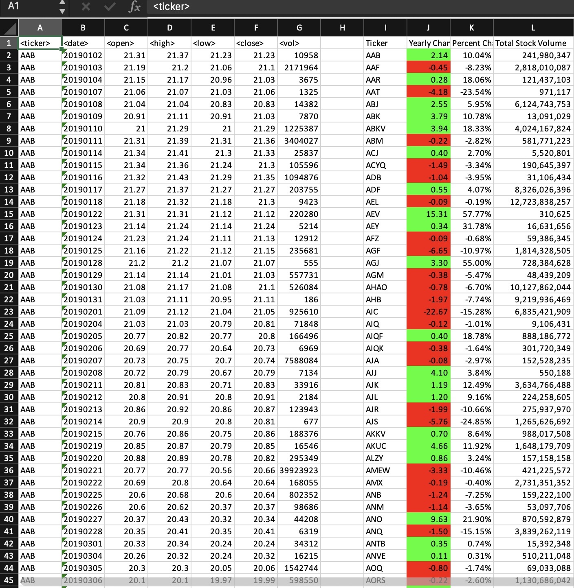
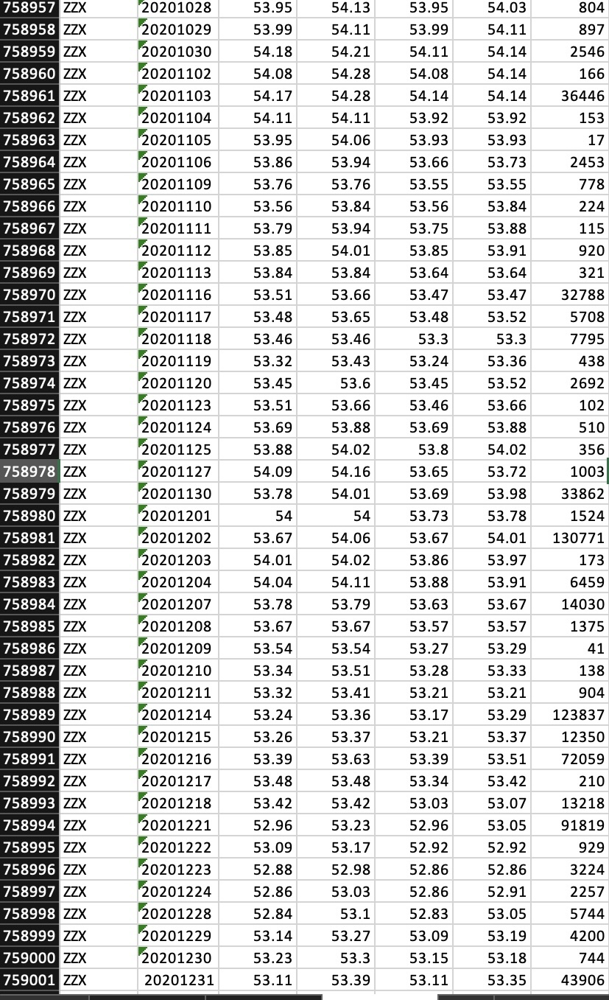

# Stock Market Analysis VBA Project

## Overview

This VBA project analyzes stock data over multiple quarters and outputs key metrics such as:
- Ticker symbol
- Quarterly change in stock price
- Percentage change in stock price
- Total stock volume

The script processes multiple excel worksheets (representing different quarters) and calculates the requested metrics for each stock symbol.

## Project Instructions

The script loops through all stock tickers for each quarter (worksheet) and outputs the following information:

- **Ticker Symbol**
- **Yearly Change**: Difference between the opening price at the beginning of a given quarter and the closing price at the end of that quarter.
- **Percent Change**: The percentage change in stock price from the beginning to the end of the quarter.
- **Total Stock Volume**: The total volume of stock traded during the quarter.

Additionally, the script highlights positive changes in green and negative changes in red.

### Moderate Solution

The script is extended to calculate:
- **Greatest % increase**
- **Greatest % decrease**
- **Greatest total volume**

This information is outputted for each quarter.

### Hard Solution

The script is designed to process every worksheet at once to allow for analysis across all quarters.

## Sample Output

The output of the script matches the structure shown in the images provided, with stock ticker information, quarterly changes, percentage changes, and total volume displayed clearly.

### 2018 Example Output:

### 2019 Example Output:

### 2020 Example Output:

